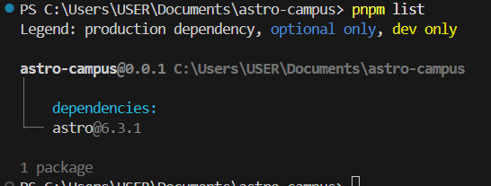
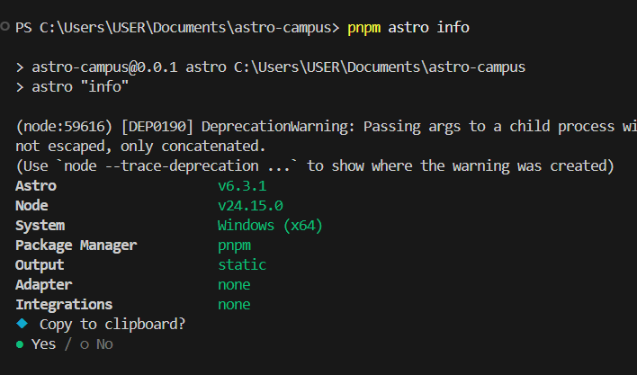
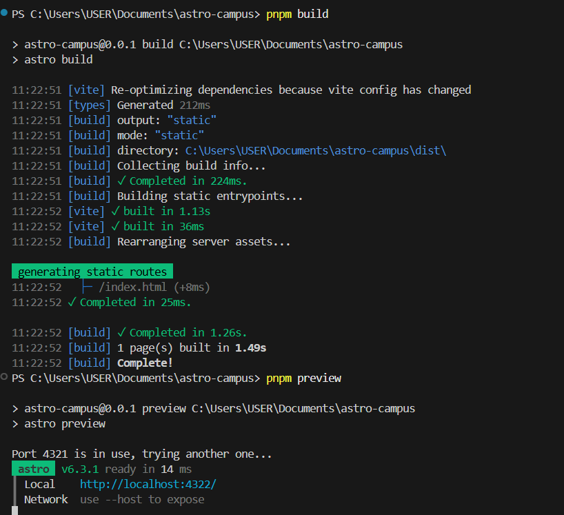
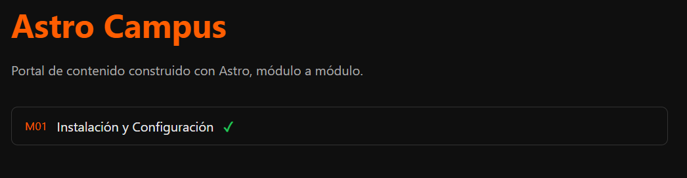

# Astro-Campus

## Modulo 1
En esta práctica se realizó la instalación y configuración inicial de Astro utilizando la plantilla minimal. Además, se verificó el funcionamiento del entorno de desarrollo, la estructura base del proyecto y la ejecución del servidor local y build de producción.

--- 

### 1. Creación del proyecto

---

### 2. Salida de pnpm astro info

---
### 3. Sitio corriendo en local host

---

### 4. Salida del build de producción
